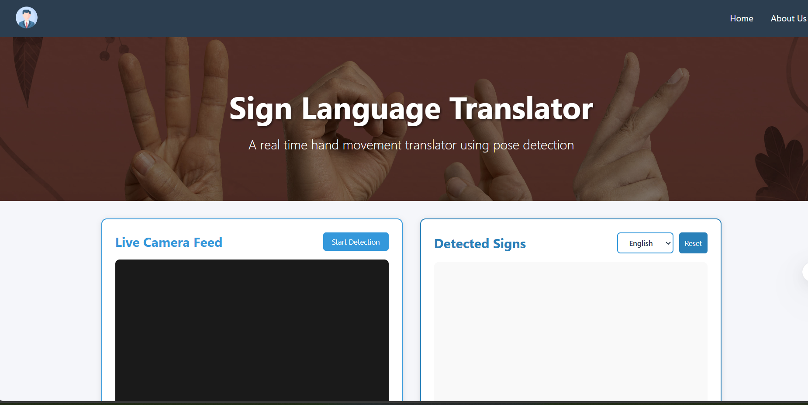
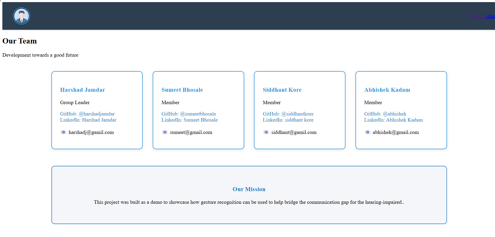
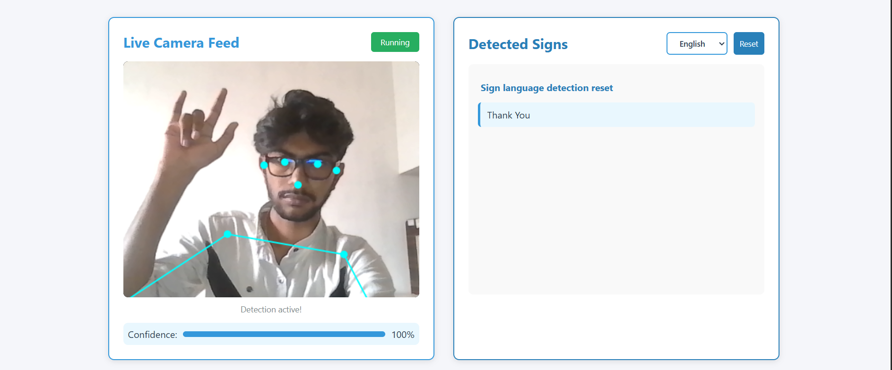

# 🤟 Sign Language Translator Demo
This is a demo project for real-time Sign Language Translation via a web application. It showcases the basic pipeline of capturing hand gestures using a webcam, processing them with a trained model, and displaying the translated output on the screen.

    ⚠️ This is a demo version trained on only 4 hand gestures and meant for educational purposes only.

## 🌟 Features
- Real time hand gesuture recognition via webcam.
- Trained on 4 custom gestures.

## 🧠 Machine Learning Model
- Model Type: CNN-based image classification
- Dataset: Custom dataset with 4 gesture classes
- Framework: TensorFlow/Keras
- Input: Processed webcam frames
- Output: Predicted gesture label

## 🖥️ Tech Stack
| Component  | Technology Used       |
| ---------- | --------------------- |
| Frontend   | HTML, CSS             |
| ML Model   | TensorFlow / Keras    |
| Deployment | Localhost (for demo)  |

## 🎯 Supported Gestures
This demo recognizes the following 4 gestures:

👋 Hello

🙏 Thank You

✋ Help

😔 Sorry

    You can customize this section based on your actual trained classes.

## ScreenShots
### Homepage

### About Us

### Sign Language Recognition

## 🛠️ Future Improvements
- Train model on full Indian Sign Language dataset
- Add sentence/word translation instead of single gestures
- Improve accuracy and reduce latency
- Host the demo online

## 🙌 Credits
This project was built as a demo to showcase how gesture recognition can be used to help bridge the communication gap for the hearing-impaired.